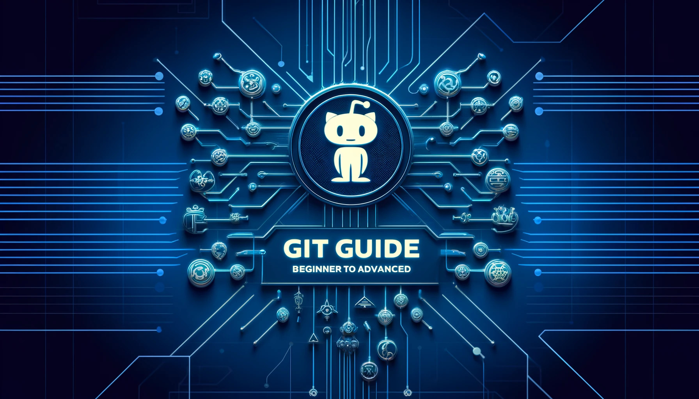

# Git Guide: Beginner to Advanced

Welcome to the Git Guide that takes you from a beginner to an advanced user! This repository is organized into four main sections:

1. [Beginner Guide](#1-beginner-guide)
2. [Advanced Guide](#2-advanced-guide)
3. [Git Error Handling Guide](#3-git-error-handling-guide)
4. [Software Licenses Guide](#4-software-licenses-guide)

## 1. Beginner Guide

The Beginner Guide is designed to help new users understand and use Git with practical examples.

### Table of Contents
1. [Introduction](beginner/README.md#introduction)
2. [Basic Commands](beginner/README.md#basic-commands)
3. [Branching](beginner/README.md#branching)
4. [Merging](beginner/README.md#merging)
5. [Resources](beginner/README.md#resources)

## 2. Advanced Guide

The Advanced Guide covers more complex Git topics for users who are already familiar with the basics.

### Table of Contents
1. [Rebasing](advanced/README.md#rebasing)
2. [Cherry-Picking](advanced/README.md#cherry-picking)
3. [Stashing](advanced/README.md#stashing)
4. [Resources](advanced/README.md#resources)

## 3. Git Error Handling Guide

The Git Error Handling Guide provides solutions and explanations for common Git errors and issues.

### Table of Contents
1. [Common Git Errors and Solutions](error-handling/git_error_handling_guide.md#common-git-errors-and-solutions)
    - [Error: Updates were rejected because the remote contains work that you do not have locally](error-handling/git_error_handling_guide.md#error-updates-were-rejected-because-the-remote-contains-work-that-you-do-not-have-locally)
    - [Error: Failed to merge unrelated histories](error-handling/git_error_handling_guide.md#error-failed-to-merge-unrelated-histories)
    - [Error: Permission denied (publickey)](error-handling/git_error_handling_guide.md#error-permission-denied-publickey)
    - [Error: Not a git repository (or any of the parent directories)](error-handling/git_error_handling_guide.md#error-not-a-git-repository-or-any-of-the-parent-directories)
    - [Error: Merge conflict](error-handling/git_error_handling_guide.md#error-merge-conflict)
    - [Error: Detached HEAD](error-handling/git_error_handling_guide.md#error-detached-head)
    - [Error: Unable to resolve reference](error-handling/git_error_handling_guide.md#error-unable-to-resolve-reference)
    - [Error: Failed to push some refs](error-handling/git_error_handling_guide.md#error-failed-to-push-some-refs)
    - [Error: Another git process seems to be running in this repository](error-handling/git_error_handling_guide.md#error-another-git-process-seems-to-be-running-in-this-repository)
    - [Error: Your branch is ahead of 'origin/main' by X commits](error-handling/git_error_handling_guide.md#error-your-branch-is-ahead-of-originmain-by-x-commits)
2. [Conclusion](error-handling/git_error_handling_guide.md#conclusion)

## 4. GitHub use case

The common GitHuse use cases.

## Table of Contents
1. [Raising and Resolving Issues](/Git-usecase/git-use-case.md#1-raising-and-resolving-issues)
2. [Forking a Repository](/Git-usecase/git-use-case.md#2-forking-a-repository)
3. [Creating a Pull Request](/Git-usecase/git-use-case.md#3-creating-a-pull-request)

## 4. Software Licenses Guide

Navigate to the [Software Licenses Guide](Software-Licenses-Guide/Software_Licenses_Guide.md) for detailed information on different types of software licenses and their usage.

## License

[MIT](/LICENSE)
